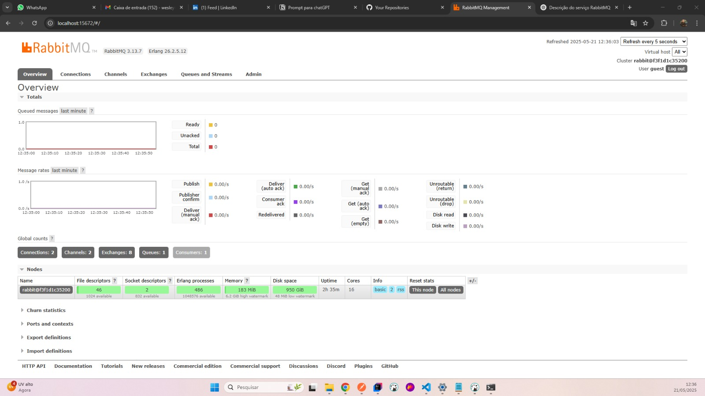
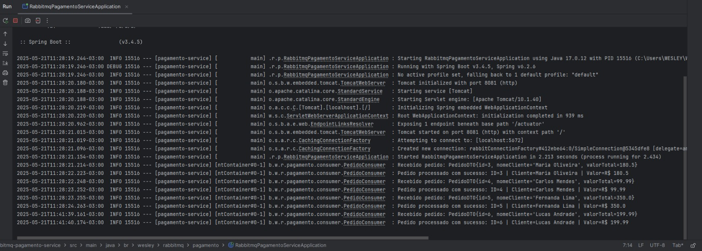

# 🧾 rabbitmq-pagamento-service

Este projeto é uma das **3 partes** do sistema de pedidos com mensageria assíncrona usando **RabbitMQ**.

Ele representa o **Consumer**, ou seja, o serviço que escuta mensagens enviadas pelo serviço de pedidos (`rabbitmq-pedido-service`) e **simula o processamento de pagamentos** com base nesses dados.

---

## 🧱 Visão Geral do Sistema

O projeto completo é formado por três partes:

| Projeto                      | Função Principal                                                           |
|-----------------------------|----------------------------------------------------------------------------|
| `rabbitmq-pedido-service`   | Envia mensagens com pedidos para a fila RabbitMQ                          |
| `rabbitmq-pagamento-service`| Escuta a fila e processa os pagamentos                                    |
| `rabbitmq-lab-infra`        | Contém RabbitMQ e PostgreSQL via Docker Compose                          |

📌 O `rabbitmq-pagamento-service` é responsável por escutar a fila `pagamento.pedido` e processar cada mensagem recebida.


## 📁 Estrutura do Projeto

```bash
rabbitmq-pagamento-service
├── src
│   └── main
│       ├── java
│       │   └── br
│       │       └── wesley
│       │           └── rabbitmq
│       │               └── pagamento
│       │                   ├── RabbitmqPagamentoServiceApplication.java
│       │                   ├── config
│       │                   ├── consumer
│       │                   └── dto
│       └── resources
│           └── application.properties
````
---

## ⚙️ O que este serviço faz

- Se conecta ao **RabbitMQ** na porta padrão 5672
- Escuta a **fila `pagamento.pedido`**
- Converte a mensagem JSON em um **DTO Java**
- Simula o processamento (exibindo logs)
- Exibe no console o resultado

### 📋 Exemplo de Log
```
Recebido pedido: PedidoDTO{id=6, nomeCliente='Lucas Andrade', valorTotal=199.99}
Pedido processado com sucesso: ID=6 | Cliente=Lucas Andrade | Valor=R$ 199.99
```


---

## 🔧 Como rodar este projeto

> É necessário ter o ambiente `rabbitmq-lab-infra` rodando com Docker.

### 1. Suba o RabbitMQ com Docker Compose:
```bash
cd rabbitmq-lab-infra
docker-compose up -d
```



### 2. Build e execução
```bash
cd rabbitmq-pagamento-service
mvn clean install
mvn spring-boot:run
```


---

## 🧪 Como testar

1. Execute o `rabbitmq-pedido-service` e envie um pedido via Postman.
2. O serviço `pagamento-service` automaticamente irá receber e processar a mensagem.
3. Veja os logs no console:



---

## 🗂️ Fila escutada

- **Exchange**: `pagamento.direct`
- **Fila**: `pagamento.pedido`
- **Routing Key**: `pagamento.pedido`

---

## 👤 Autor

**Wesley Martins Rosa**  
📧 Email: wesleymrosa@gmail.com  
🐙 GitHub: [@wesleymrosa](https://github.com/wesleymrosa)  
💼 LinkedIn: [Wesley Martins Rosa](https://linkedin.com/in/wesley-martins-rosa-5118aa15a)

---

## 📅 Licença

Projeto com fins educacionais.  
Sinta-se à vontade para estudar, adaptar e aprimorar conforme sua necessidade.
